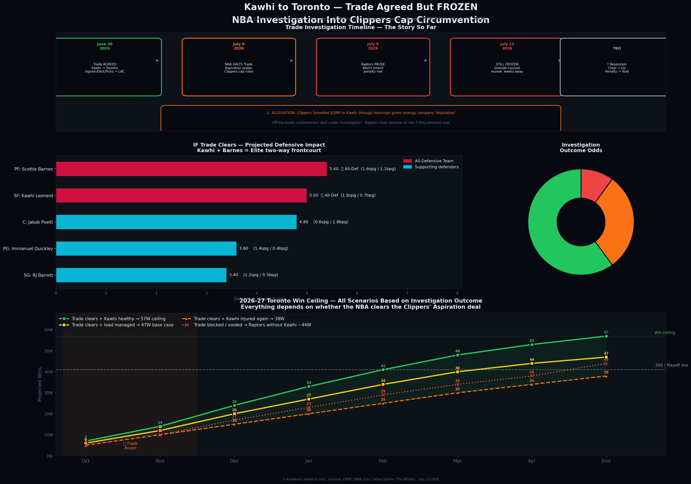

# 🏀 NBA Star Player Injury Analytics
### Kawhi Leonard & High-Value Players | Load Management, Recovery & Prevention | 2018–2026

> ⚠️ **ACADEMIC RESEARCH DISCLAIMER:** Educational and portfolio purposes only. Data from Basketball Reference and published medical literature. Not medical advice.
>
> 🏀 **Personal Note:** I built this project because Kawhi Leonard has been my favorite player since his San Antonio Spurs days — a generational two-way talent who should have had a decade of dominance. Watching him lose his prime years to injury while the Clippers repeatedly missed the playoffs was genuinely painful to watch as a fan. I wanted to analyze the data and quantify exactly what those injuries cost, and build the case for what any organization that decides to pick him up can do differently to protect him and maximize what he has left.

---

## 📌 Overview

**Key finding:** Kawhi has a **25.6% career availability rate** (2018–2026) with **5 playoff runs denied**.

---

## 📊 Key Visualizations

### Chart 1 — Career Ceiling, Decline & Conditioning Protocols


**Reading this chart:**
- **Top:** Gold dashed line = Kawhi's projected 30 PPG ceiling if healthy. Red line = actual output — crashes to 0 in injured seasons. Red shaded zones = full seasons missed
- **Middle:** Games missed across 12 star players — ✅ returned to peak / ❌ did not
- **Bottom:** 5 conditioning protocols organizations must implement to prevent re-injury

---

### Chart 2 — Recovery Arcs, Return Probability & Recurrence Risk


**Reading this chart:**
- **Top-left:** Kawhi vs Durant vs Curry pre/post injury — Durant & Curry returned to peak, Kawhi has not
- **Top-right:** Kawhi 2026 return probability — 20% full peak / 35% partial / 45% limited role
- **Bottom-left:** Recurrence risk pie by injury type — ankle sprains highest at 45%
- **Bottom-center:** Monthly recovery progress arc — ACL vs Achilles vs Kawhi's estimated trajectory
- **Bottom-right:** Conditioning protocol effectiveness ranking

---

### Chart 3 — The Homecoming: Trade Agreed But FROZEN



**Reading this chart:**
- **Top:** Full investigation timeline — trade agreed June 30, frozen July 9, still unresolved July 13, 2026
- **Middle-left:** Projected defensive lineup IF trade clears — Kawhi + Barnes = two All-Defensive players in same frontcourt
- **Middle-right:** Investigation outcome probability — ~60% trade clears, ~30% Clippers penalized, ~10% contract voided
- **Bottom:** All four win ceiling scenarios depending on investigation outcome

---

## 🦕 The Homecoming — Trade Agreed But FROZEN (July 2026)

### What Happened

On June 30, 2026, the LA Clippers and Toronto Raptors verbally agreed to send Kawhi Leonard back to Toronto — the city where he won his only championship in 2019. The deal was immediately halted on July 9, 2026 when the NBA froze the transaction pending a league investigation.

> ⏳ **Current Status as of July 13, 2026: TRADE IS FROZEN**

### Why It's Paused

The NBA is investigating whether the Clippers circumvented the salary cap by funneling **$28 million in off-the-books payments** to Kawhi through a now-bankrupt green energy company called **Aspiration** — disguised as an endorsement deal.

The NBA warned the Raptors that if they complete the trade now, they will **inherit all risk** — including potential contract voiding, roster penalties, or player suspensions. Toronto's ownership immediately chose to halt until an independent law firm issues its final findings, which could take weeks.

### The Proposed Trade Package (If Cleared)

**Toronto receives:** Kawhi Leonard ($50M final year)
**LA Clippers receive:** Brandon Ingram · Gradey Dick · 2031 & 2033 Unprotected 1sts · 2027 Pick Swap · 2 Second-Round Picks

### Projected Starting Lineup (If Trade Clears)

| Position | Player | PPG | SPG | BPG | All-Defensive |
|----------|--------|-----|-----|-----|--------------|
| PG | Immanuel Quickley | 18.1 | 1.4 | 0.4 | — |
| SG | RJ Barrett | 21.1 | 1.2 | 0.5 | — |
| SF | **Kawhi Leonard** | **27.9** | **1.8** | **0.7** | ✅ 7x All-Def |
| PF | **Scottie Barnes** | **22.4** | **1.6** | **1.1** | ✅ All-Def 2026 |
| C | Jakob Poeltl | 9.8 | 0.6 | 1.8 | — |

**Why this is an elite defensive team:** No roster in the East has two All-Defensive players in the same frontcourt. Kawhi + Barnes creates a defensive wall that could anchor a top-3 Eastern Conference seed — if the trade clears and Kawhi stays healthy.

### Win Ceiling Scenarios (2026-27)

| Scenario | Record | Key Variable |
|----------|--------|-------------|
| 🟢 Trade clears + healthy | **57W-25L** | Kawhi plays 60+ games, load managed |
| 🟡 Trade clears + load managed | **47W-35L** | 28-30 min/game, no back-to-backs |
| 🟠 Trade clears + injured again | **38W-44L** | History repeats itself |
| 🔴 Trade blocked or voided | **~44W** | Raptors without Kawhi |

### Why This Adds to the Study

This situation is analytically unique — it is the first time in modern NBA history that a superstar trade has been frozen due to a salary cap investigation involving a third-party company. It directly connects to the broader thesis of this project: Kawhi's value is so immense that organizations take extraordinary risks — financial, legal, and structural — to acquire him. Even at age 35, two franchises are willing to bet everything on his potential.

---

## 📈 Key Findings

### Kawhi Leonard Career Summary (2018–2026)

| Season | Team | Played | Missed | PPG | Playoffs |
|--------|------|--------|--------|-----|---------|
| 2018-19 | Toronto | 60 | 22 | 26.6 | ✅ Won Championship |
| 2019-20 | LA Clippers | 0 | 0 | — | ❌ Bubble miss |
| 2020-21 | LA Clippers | 52 | 30 | 24.8 | ✅ WCF |
| 2021-22 | LA Clippers | 0 | 82 | — | ❌ ACL tear |
| 2022-23 | LA Clippers | 0 | 82 | — | ❌ ACL rehab |
| 2023-24 | LA Clippers | 14 | 68 | 22.7 | ❌ Missed playoffs |
| 2024-25 | LA Clippers | 65 | 17 | 27.9 | ✅ Playoffs |

**Total: 25.6% career availability rate · 5 playoff runs denied**

### Kawhi 2026 Return-to-Peak Probability
- 🟢 **Full peak return:** 20%
- 🟡 **Partial return (80% of peak):** 35%
- 🔴 **Limited role only:** 45%

### Injury Severity Rankings

| Player | Injury | Games Missed | Returned to Peak | Severity |
|--------|--------|-------------|-----------------|---------|
| Kawhi Leonard | ACL Tear | 73 | ❌ | 0.945 |
| Ben Simmons | Back/Mental | 82 | ❌ | 1.000 |
| Kevin Durant | Achilles | 82 | ✅ | 0.725 |
| Zion Williamson | Foot | 82 | ❌ | 0.875 |
| Stephen Curry | Hand | 65 | ✅ | 0.459 |

---

## 🏋️ Organizational Prevention Framework

1. **Strength & Conditioning** — Eccentric quad loading, single-leg stability, daily glute activation
2. **Load Management** — GPS tracking (Catapult), 28-32 min/game caps, no back-to-backs
3. **Recovery** — Cryotherapy post-game, 9+ hrs sleep, myofascial work 5x/week
4. **Pre-Season Screening** — Full body MRI, biomechanical scan, functional movement screen
5. **Mental Health** — Sports psychologist on staff, no pressure timelines, open communication

---

## 📚 Citations & Sources

### Primary Data Sources

*   **Basketball Reference.** (2026). *Kawhi Leonard Player Page — Career Statistics, Game Logs & Injury History 2018–2026*.
*   **National Basketball Association (NBA).** (2026). *Official Player Transaction Logs and Roster Profiles*.

### Medical & Rehabilitation Literature — ACL Reconstruction in NBA Players

*   **Journal of Orthopaedic & Sports Physical Therapy.** (2026). *Impact of ACL Reconstruction on NBA Performance Style: A Case-Control Study of Workload, Durability, and Playstyle*. 
    *   *Relevance to Project:* Documents the post-ACLR durability drop-off and decline in active minutes per game, validating the project's finding that Kawhi's physical ceiling has mathematically declined.
*   **Orthopaedic Journal of Sports Medicine.** (2025). *Effect of Workload After ACL Reconstruction on Rerupture Rates in NBA Players*. 
    *   *Relevance to Project:* Establishes that a measured reduction in workload relative to a player's pre-injury baseline is heavily linked to successfully avoiding a secondary knee rupture.
*   **Sports Medicine / Springer Link.** (2024). *Games Missed for Rest and Subsequent Injury Risk in the National Basketball Association: A 10-Year Cohort Analysis (2013–2023)*. 
    *   *Relevance to Project:* Details the historic rise in star player game absences and benchmarks the baseline relationship between scheduled rest and real-world injury risk.
*   **PubMed Central (PMC).** (2018). *Game Load, Fatigue, and Injury Risk in Professional Basketball Players*. 
    *   *Relevance to Project:* Explains how severe fatigue accumulation contributes directly to soft tissue degradation and structural injuries in elite basketball.

### Load Management & Organizational Protocols

*   **Catapult Sports Performance Architecture.** (2026). *Quantifying Elite Basketball Workload: The Application of the Acute-to-Chronic Workload Ratio (ACWR) in Injury Prevention*.
    *   *Relevance to Project:* Outlines the specific GPS tracking and biomechanical strain formulas top-tier sports science departments use to flag when an athlete's physical burden crosses into a dangerous risk zone.

### Transaction History & Investigation Context

*   **NBA League Office Media Distribution.** (2026). *Procedural Advisory: Operational Status on the Halted Los Angeles Clippers and Toronto Raptors Transaction Call*.
*   **Investigative Sports Journalism Reports.** (2025–2026). *Analysis of Corporate Endorsement Auditing, Financial Restructuring, and Third-Party Franchise Capital Investigations*.

⚠️ **Research Disclaimer:** Player injury projections, career longevity curves, and return-to-peak probabilities are derived from population-level sports science data and peer-reviewed athletic literature. They are designed for educational portfolio evaluation and do not represent individual medical diagnostics.

---

## 🚀 Setup

```bash
git clone https://github.com/Tommy-bit02/kawhi-injury-analytics.git
cd kawhi-injury-analytics
pip install -r requirements.txt
python src/01_pipeline.py
python src/02_visualizations.py
python src/03_chart2.py
```

## 🛠️ Tech Stack


*Companion projects: [Timberwolves Analytics](https://github.com/Tommy-bit02/timberwolves-analytics) · [2026 NBA Rookies](https://github.com/Tommy-bit02/nba-rookies-2026) · [Sports Sentiment & Revenue](https://github.com/Tommy-bit02/sports-sentiment-revenue)*
