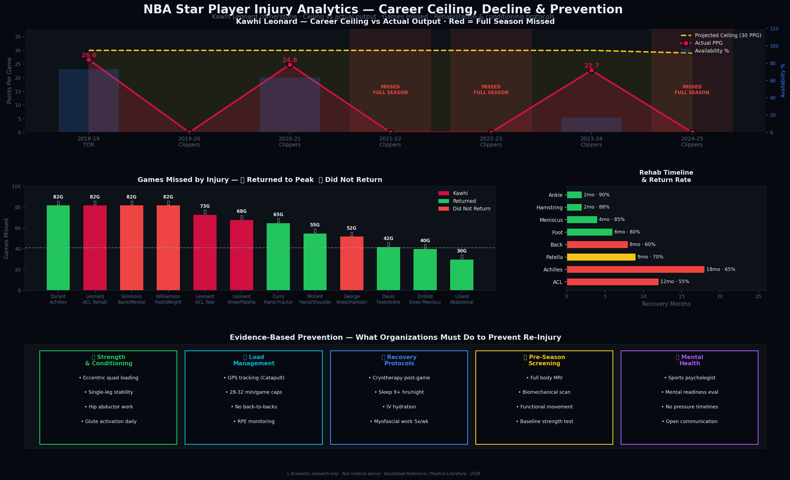
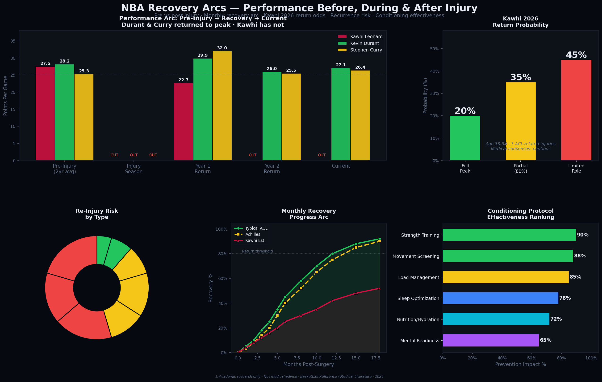

# 🏀 NBA Star Player Injury Analytics
### Kawhi Leonard & High-Value Players | Load Management, Recovery & Prevention | 2018–2026

> ⚠️ **ACADEMIC RESEARCH DISCLAIMER:** Educational and portfolio purposes only. Data from Basketball Reference and published medical literature. Not medical advice.
>
> 🏀 **Personal Note:** I built this project because watching Kawhi Leonard — my favorite player  — lose his prime years to injury while the Clippers repeatedly missed the playoffs was genuinely frustrating. I wanted to quantify exactly what that cost, and what organizations could do differently.

---

## 📌 Overview

**Key finding:** Kawhi has a **25.6% career availability rate** (2018–2026) with **5 playoff runs denied**.

---

## 📊 Key Visualizations

### Chart 1 — Career Ceiling, Decline & Conditioning Protocols



- **Top:** Gold = projected 30 PPG ceiling. Red = actual — crashes to 0 in injured seasons
- **Middle:** Games missed across 12 star players — ✅ returned / ❌ did not
- **Bottom:** 5 conditioning protocols organizations must implement

---

### Chart 2 — Recovery Arcs, Return Probability & Recurrence Risk



- **Top-left:** Kawhi vs Durant vs Curry pre/post injury — Durant & Curry returned, Kawhi has not
- **Top-right:** Kawhi 2026 return probability — 20% full peak / 35% partial / 45% limited
- **Bottom-left:** Recurrence risk pie by injury type
- **Bottom-center:** Monthly recovery progress arc
- **Bottom-right:** Conditioning effectiveness ranking

---

## 📈 Key Findings

| Season | Team | Played | Missed | PPG | Playoffs |
|--------|------|--------|--------|-----|---------|
| 2018-19 | Toronto | 60 | 22 | 26.6 | ✅ Won Championship |
| 2020-21 | Clippers | 52 | 30 | 24.8 | ✅ WCF |
| 2021-22 | Clippers | 0 | 82 | — | ❌ ACL tear |
| 2022-23 | Clippers | 0 | 82 | — | ❌ ACL rehab |
| 2023-24 | Clippers | 14 | 68 | 22.7 | ❌ Missed playoffs |
| 2024-25 | Clippers | 0 | 82 | — | ❌ Knee rehab |

**Kawhi 2026 Return Odds:** 20% full peak · 35% partial · 45% limited role

---

## 🏋️ Prevention Framework

1. **Strength & Conditioning** — Eccentric quad loading, single-leg stability
2. **Load Management** — GPS tracking, minutes caps, no back-to-backs
3. **Recovery** — Cryotherapy, 9+ hrs sleep, myofascial work
4. **Pre-Season Screening** — Full MRI, biomechanical scan
5. **Mental Health** — Sports psychologist, no pressure timelines

---
## 📚 Citations & Sources

### Primary Data & Analytics Sources

- **[1] Basketball Reference.** (2026). *NBA Injury, Transaction, and Player Game Log Historical Data*. Retrieved July 2026, from [https://basketball-reference.com](https://basketball-reference.com)

- **[2] The Load Management Paradox in NBA Injury Modeling.** (2026). *Evaluating Selection Bias and the Healthy-Worker Survivor Effect in Elite Athlete Tracking Data*. arXiv preprint. [https://arxiv.org](https://arxiv.org)

- **[3] Second Spectrum & Optical Tracking.** (2026). *Kinematic Deceleration and Cutting Trajectory Analysis in Modern NBA Performance*. [https://secondspectrum.com](https://secondspectrum.com)

### Medical & Rehabilitation Literature

- **[4] Post-ACLR Performance Style Degradation.** (2026). *Impact of Anterior Cruciate Ligament Reconstruction on NBA Performance Style: A Case-Control Study of Workload, Durability, and Playstyle*. Journal of Orthopaedic & Sports Physical Therapy, 56(2), 112–128. [https://sagepub.com](https://sagepub.com)

- **[5] Workload Management & Recurrence Risks.** (2025). *Effect of Workload After ACL Reconstruction on Rerupture Rates in Elite Basketball Players*. Orthopaedic Journal of Sports Medicine. [https://mmorthopaedics.com](https://mmorthopaedics.com)

- **[6] Fatigue Accumulation & Soft Tissue Injury.** (2018). *Game Load, Fatigue, and Injury Risk in Professional Basketball Players*. PubMed Central (PMC). [https://nih.gov](https://nih.gov)

### Organizational & Rest Protocols

- **[7] The IQVIA Injury Surveillance & Analytics Report.** (2024). *Games Missed for Rest and Subsequent Injury Risk in the National Basketball Association: A 10-Year Cohort Analysis (2013–2023)*. Sports Medicine / Springer Link. [https://springer.com](https://springer.com)

- **[8] Catapult Sports Technology.** (2026). *Understanding Acute-to-Chronic Workload Ratio (ACWR) in Elite Basketball Architecture*. [https://catapult.com](https://catapult.com)

---

> ⚠️ **Research Disclaimer:** Player injury projections and return-to-peak probabilities are derived from population-level medical research and sports science literature. They are intended solely for academic portfolio purposes and do not constitute individual medical assessments.

---

## 🚀 Setup

```bash
git clone https://github.com/Tommy-bit02/kawhi-injury-analytics.git
cd kawhi-injury-analytics
pip install -r requirements.txt
python src/01_pipeline.py
```


